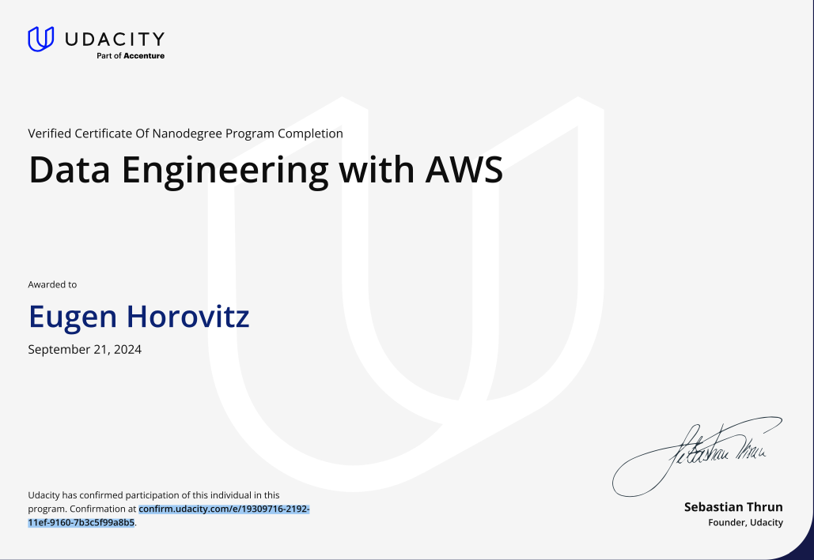
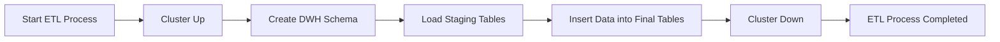
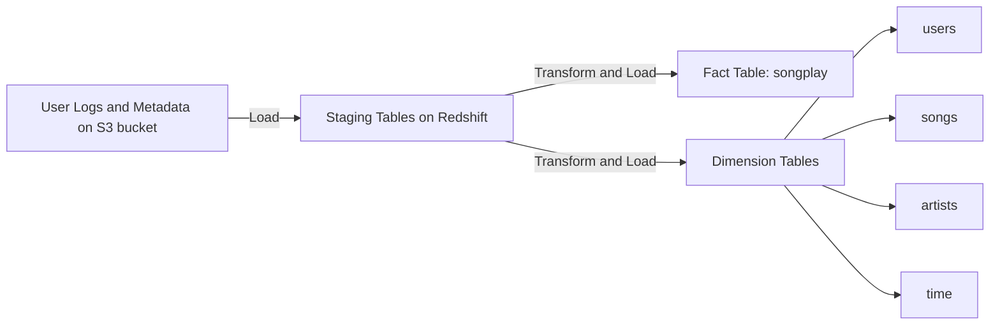

This is the project no 2 from a short nano degree at udacity :  


1. **Data Modeling with Apache Cassandra** ( to be added ) 
   - Create a non-relational database for a music streaming app.
   - Define queries and tables using Apache Cassandra.

2. **Data Warehouse**  ( current ) 
   - Build an ELT pipeline for a streaming music service.
   - Extract data from S3, stage in Redshift, and transform into dimensional tables.

3. **Data Lakehouse with AWS** https://github.com/euhoro/data_engineering_aws_glue
   - Develop a data lakehouse solution for sensor data.
   - Use Spark and AWS Glue for processing and analytics.

4. **Automate Data Pipelines** https://github.com/euhoro/data_engineering_aws_airflow
   - Create and manage data pipelines using Apache Airflow.
   - Implement data validation, DAGs, and data quality concepts.
   - Extend Airflow with plugins and refactor DAGs for production.

## Certificate
<p align="center">
  
</p>

( for a more details and contents - https://github.com/orlevit/Data_Engineering_with_AWS ) 

# Sparkify DE Project

### Introduction

A music streaming startup, Sparkify, has grown its user base and song database and wants to move its processes and data onto the cloud. Their data resides in S3, in a directory of JSON logs on user activity on the app, as well as a directory with JSON metadata on the songs in their app.

As their data engineer, you are tasked with building an ETL pipeline that extracts their data from S3, stages them in Redshift, and transforms data into a set of dimensional tables for their analytics team to continue finding insights into what songs their users are listening to.

### Project Files

This project includes three main components:

1. **main.py**
   - **Script**: `main.py`
   - **Description**: Contains the main logic to start up the cluster, create the schema, load the data, and shut down the cluster.

2. **create_tables.py**
   - **Script**: `create_tables.py`
   - **Description**: Contains the logic to create the schema in Redshift.

3. **etl.py**
   - **Script**: `etl.py`
   - **Description**: Contains the logic to load data from S3 into staging tables in Redshift and then insert the data into the final tables.

4. **sql_queries.py**
   - **File**: `sql_queries.py`
   - **Description**: Contains all the SQL queries used to create, drop, copy, and insert data into tables.

5. **dwh.cfg**
   - **File**: `dwh.cfg.sample`
   - **Description**: Configuration file that contains AWS credentials and Redshift cluster information.it should be renamed to dwh.cfg

### ETL Code



### ETL Pipeline



### Table Design

Database Schema

### Database Schema

| Table Name       | Columns                                                                                                   | Type      |
|------------------|-----------------------------------------------------------------------------------------------------------|-----------|
| staging_events   | artist, auth, firstName, gender, itemInSession, lastName, length, level, location, method, page, registration, sessionId, song, status, ts, userAgent, userId | Staging   |
| staging_songs    | num_songs, artist_id, artist_latitude, artist_longitude, artist_location, artist_name, song_id, title, duration, year | Staging   |
| songplay         | songplay_id, start_time, user_id, level, song_id, artist_id, session_id, location, user_agent | Fact      |
| users            | user_id, first_name, last_name, gender, level                                                             | Dimension |
| songs            | song_id, title, artist_id, year, duration                                                                 | Dimension |
| artists          | artist_id, name, location, latitude, longitude                                                            | Dimension |
| time             | start_time, hour, day, week, month, year, weekday                                                         | Dimension |


### Running the Scripts

#### Prerequisites
- Ensure that `dwh.cfg` after renaming the file dwh.cfg.sample to dwh.cfg. make sure it is correctly configured .
- Create virtual env: `virtualenv venv --python=python3.10`
- Activate virtual env: `source venv/bin/activate`

#### Steps

1. **Run the script**
   - Run `main.py` to set up the tables in Redshift and run the etl:
     ```bash
     python main.py
     ```
